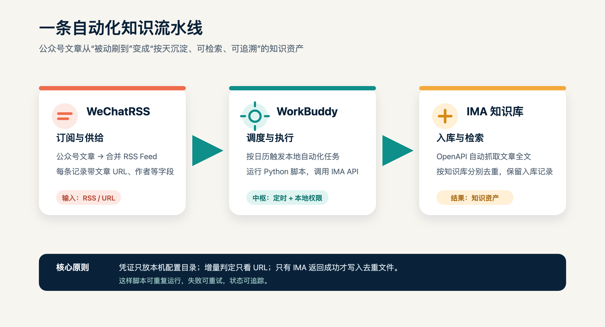
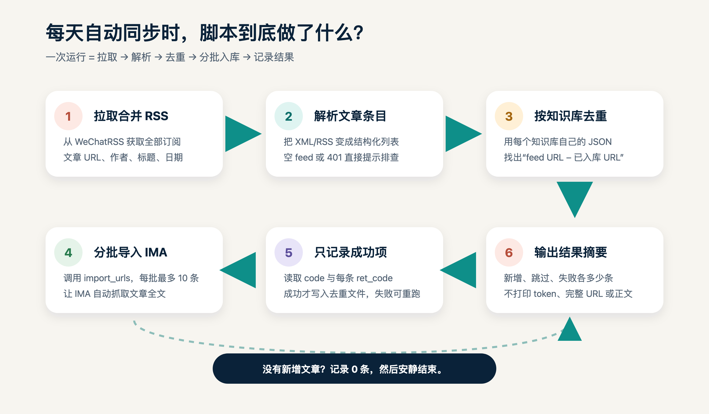
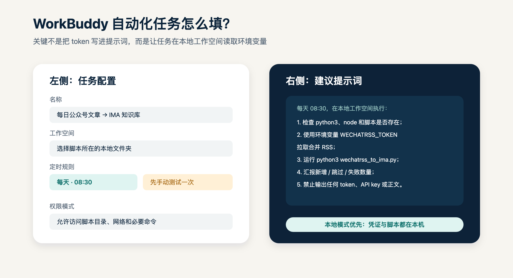
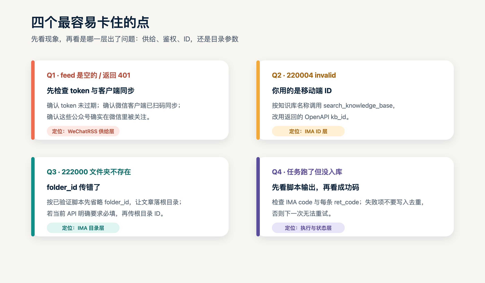

# 把公众号更新自动沉淀进 IMA：WorkBuddy × WeChatRSS 的每日知识库流水线

> 一次配置，每天自动拉取订阅的公众号文章；只把新增内容写入指定的 IMA 知识库，并保留可追踪的入库状态。


很多人都有同一个困扰：关注了几十个公众号，真正有价值的内容散落在微信聊天列表里。等到想查某个观点、某个数据或某篇文章时，要么记不起来源，要么已经很难翻回去。

这篇文章介绍一套可以落地的做法：

**WeChatRSS 负责把订阅的公众号文章整理成 RSS，WorkBuddy 负责按日历触发本地任务，IMA 负责把文章链接抓取并沉淀为可检索的知识库内容。**

它不是“把所有微信内容搬走”，而是围绕公开文章链接建立一条可重复运行的增量流水线：有新文章就入库，没有新文章就结束；中途失败可以重试，已经成功的文章不会重复导入。

---

## 一、先看懂这套组合：三个工具各做什么

| 工具 | 在流程中的角色 | 你需要关注的事情 |
|---|---|---|
| WeChatRSS | 文章供给层 | 订阅公众号、获取合并 RSS、维护 token |
| WorkBuddy | 调度与执行层 | 选择本地工作空间、设置每天的执行时间、查看任务结果 |
| IMA | 知识库目标端 | 配置 OpenAPI 凭证、找到 OpenAPI 侧的知识库 ID、检查入库结果 |



这条链路里，WorkBuddy 并不替代 WeChatRSS 或 IMA。它更像一个“会按时执行的本地工作助手”：到了设定时间，执行拉 RSS、解析、去重和调用 IMA API 的脚本。

---

## 二、开始前要准备什么

### 1. 一台可以联网的电脑

本文按 **WorkBuddy 本地工作空间** 设计。脚本需要访问本机的 Python、Node.js、IMA skill 文件和本地凭证，因此第一次配置时不要把任务设置成无法访问本地文件的云端环境。

准备好：

- `python3`
- `node`
- WorkBuddy 桌面端或可控制本机的 WorkBuddy 工作空间
- IMA OpenAPI skill，能够调用 `ima_api.cjs`
- WeChatRSS 提供的 JWT token
- IMA 开放平台的 `client_id` 和 `api_key`

### 2. 两条安全底线

第一，**token、client_id、api_key 不要写进文章、脚本截图或 WorkBuddy 提示词**。它们只放在本机环境变量或 `~/.config/ima/` 配置目录里。

第二，**公众号文章链接和 IMA 知识库 ID 都属于配置数据**。公开发布教程时使用占位符，不要把个人订阅列表、真实知识库 ID 和运行日志一起放出去。

---

## 三、第一步：在 WeChatRSS 建立公众号文章入口

### 1. 进入官网并完成订阅

访问 [WeChatRSS 微信公众号 RSS 订阅服务](https://wechatrss.waytomaster.com/)。官网当前展示的基本逻辑是：先在微信里关注公众号，再由客户端同步可获取的文章，最后通过 RSS、API 或 MCP 等方式供阅读器和 AI 使用。

官网当前页面展示为“2 个公众号免费、付费 ¥9.9/月起”；价格和套餐可能变化，实际以官网页面为准。

有一个容易忽略的前提：**网页端添加订阅，并不等于替你在微信里关注公众号**。如果微信客户端没有关注，或者客户端没有完成同步，RSS 可能为空。

### 2. 获取合并 RSS

WeChatRSS 提供“全部订阅”合并 feed。文章中使用的地址形式是：

```text
https://wechatrss.waytomaster.com/api/rss/all?token=<你的 WECHATRSS_TOKEN>
```

在本机测试时，建议让 token 通过环境变量传入：

```bash
export WECHATRSS_TOKEN="<完整 JWT>"
curl -sL "https://wechatrss.waytomaster.com/api/rss/all?token=$WECHATRSS_TOKEN" -o /tmp/rss_all.xml
```

看到 feed 中有文章条目、每条有文章链接后，再进入下一步。不要把完整 URL 复制到公众号文章里，因为其中包含 token。

### 3. 如果 feed 为空怎么办

优先按这个顺序排查：

1. token 是否过期；
2. 微信客户端是否已经扫码同步；
3. 公众号是否真的在微信里被关注；
4. `curl` 是否返回 401；
5. WeChatRSS 客户端或服务是否暂时不可用。

---

## 四、第二步：配置 IMA OpenAPI

### 1. 把 IMA 凭证放到本机配置目录

推荐使用本机配置目录，不要把凭证放在项目工作区：

```bash
mkdir -p ~/.config/ima
printf '%s' '<Client ID>' > ~/.config/ima/client_id
printf '%s' '<API Key>'  > ~/.config/ima/api_key
```

`ima_api.cjs` 会读取这两个文件，并将它们作为请求头发送给 IMA 官方接口。不同版本的 skill 也可能支持环境变量，按你当前安装的 skill 文档为准。

### 2. 找到 OpenAPI 侧的知识库 ID

这是整条链路中最容易踩坑的一步。

IMA 移动端或桌面端看到的知识库 ID，不一定能直接用于 OpenAPI。需要用知识库名称搜索，取返回结果里的 OpenAPI `kb_id`：

```bash
cd <ima-skill 目录>
node ima_api.cjs "openapi/wiki/v1/search_knowledge_base" \
  '{"query":"<知识库名称>","cursor":"","limit":20}'
```

从返回结果中找到：

```text
data.info_list[].kb_id
```

然后把它填进同步脚本的 `KBS` 配置。多个知识库要分别配置自己的 OpenAPI `kb_id`。

### 3. 关于 `folder_id` 的兼容性

本实践手册验证过的写法是调用 `import_urls` 时先省略 `folder_id`，让文章落在知识库根目录；如果你当前安装的 IMA skill 明确要求该字段，则将根目录 ID 传为知识库 ID。

遇到 `222000 文件夹不存在` 时，不要把 `kb_id` 随手当成任意子文件夹 ID。先按当前 skill 文档确认根目录参数，再重试。

---

## 五、第三步：准备增量同步脚本

脚本只做五件事：

1. 拉取 WeChatRSS 合并 RSS；
2. 解析每篇文章的 URL、标题、作者和日期；
3. 对每个 IMA 知识库，用自己的 JSON 状态文件做 URL 去重；
4. 每批最多 10 条，调用 `openapi/wiki/v1/import_urls`；
5. 只有 IMA 返回成功，才把这条 URL 写入去重文件。

示例脚本已放在本文素材包中：

[下载示例脚本：wechatrss_to_ima_example.py](scripts/wechatrss_to_ima_example.py)

把它复制到 WorkBuddy 选择的本地工作空间，并按实际情况修改：

```python
IMA_API_CJS = Path(os.environ.get("IMA_API_CJS", "./ima_api.cjs"))

KBS = [
    {
        "name": "知识库 A",
        "kb_openapi": "<OPENAPI_KB_ID>",
        "dedup": STATE_DIR / "kb-a.json",
    },
]
```

建议的目录结构：

```text
wechat-rss-ima/
├── wechatrss_to_ima.py
├── ima_api.cjs                 # 或通过 IMA_API_CJS 指向实际路径
└── state/
    ├── knowledge-base-a.json   # 每个知识库一份
    └── knowledge-base-b.json
```

去重文件记录的是 URL 到结果的映射，包含标题、作者、来源、日期、入库时间、知识库名称、`media_id` 和导入方式。它不是文章正文，也不需要放进公众号文章。



### import_urls 的核心请求

每批最多 10 条 URL，核心请求体是：

~~~json
{
  "knowledge_base_id": "<OpenAPI kb_id>",
  "urls": [
    "https://mp.weixin.qq.com/s/...",
    "https://mp.weixin.qq.com/s/..."
  ]
}
~~~

这份实践脚本默认按已验证的兼容写法省略 folder_id。如果你当前安装的 IMA skill 文档明确要求必填，就把根目录 ID 作为 folder_id 传入，并重新测试一次。

脚本要同时检查两层结果：接口顶层 code=0，以及 data.results 中每条 URL 的 ret_code=0。不要因为进程退出码为 0，就直接把所有候选文章写入去重文件。

### 为什么要“每个知识库一份去重文件”？

因为同一篇文章可能需要进入不同知识库。知识库 A 已经入库，并不代表知识库 B 也已经入库。如果所有知识库共用一个去重文件，就会出现“一个库成功后，另一个库被误跳过”的问题。

---

## 六、第四步：在 WorkBuddy 中创建每日自动化

WorkBuddy 的自动化任务通常需要填写：任务名称、提示词、工作空间、权限模式和定时规则。不同版本的入口名称可能略有差异，但配置逻辑相同：**指定本地工作目录，按时间触发一个可检查的脚本任务**。

### 推荐配置

| 配置项 | 建议填写 |
|---|---|
| 任务名称 | 每日公众号文章 → IMA 知识库 |
| 工作空间 | 选择 `wechatrss_to_ima.py` 所在目录 |
| 执行模式 | 本地模式，确保能访问本机脚本与凭证 |
| 执行频率 | 每天一次，例如 08:30 |
| 首次运行 | 先手动测试，再启用每日调度 |
| 输出要求 | 只汇报新增、成功、失败数量和错误码 |



### 可以直接使用的提示词

```text
每天 08:30，在当前本地工作空间执行公众号文章入库任务：

1. 检查 python3、node、IMA_API_CJS 和 wechatrss_to_ima.py 是否可用；
2. 使用环境变量 WECHATRSS_TOKEN 拉取 WeChatRSS 合并 RSS；
3. 运行 python3 wechatrss_to_ima.py；
4. 按脚本输出汇报新增候选、成功入库、失败和跳过数量；
5. 若失败，保留可定位的错误码和建议，不要把 token、client_id、api_key、完整 feed URL 或文章正文输出到消息中；
6. 不要修改来源文件，不要删除去重状态文件，不要重复导入已经成功的 URL。
```

如果 WorkBuddy 的任务支持“测试运行”，先测试一次；确认能看到类似下面的结果，再打开每日定时：

```text
同步完成：新增候选 12 条，成功入库 12 条，失败 0 条。
```

没有新文章时，理想结果是：

```text
同步完成：新增候选 0 条，成功入库 0 条，失败 0 条。
```

这表示任务正常结束，而不是任务失败。

如果你在终端里 export WECHATRSS_TOKEN=... 后，WorkBuddy 任务仍提示缺少 token，说明 WorkBuddy 启动的本地任务没有继承当前终端环境。此时在 WorkBuddy 支持的本地任务环境中配置同名变量，或让脚本从权限受控的本机配置文件读取 token；不要为了省事把 token 直接写进提示词。

### 本地模式的注意事项

本链路依赖本机的脚本、网络和 IMA 凭证，因此第一次调通时应使用能够访问本地文件的 WorkBuddy 工作空间。是否支持电脑关机后继续运行，取决于你使用的 WorkBuddy 模式和当前版本；不要默认认为本地任务在关机后仍然可执行。

---

## 七、第五步：用“四层验收”确认真的跑通

不要只看 WorkBuddy 显示“任务已完成”。真正的验收要看最终结果：

### 第 1 层：WeChatRSS 有输入

- RSS 文件可以拉取；
- XML 中存在文章条目；
- 每条有微信公众号文章 URL。

### 第 2 层：脚本识别出增量

- 首次运行会出现新增候选；
- 第二次立刻重跑，新增候选应为 0；
- 不同知识库分别计算差集。

### 第 3 层：IMA 返回成功

- 顶层 `code=0`；
- 每个 URL 的 `ret_code=0`；
- 成功结果中有 `media_id`。

### 第 4 层：IMA 界面可检索

在目标知识库中搜索文章标题或正文关键词，确认文章已经出现。只有这一步通过，才算“执行成功并送达”。

---

## 八、常见报错与处理顺序



### 1. feed 返回空 `<channel>` 或 0 篇

通常是 token 失效，或者 WeChatRSS 客户端还没有完成微信读书同步。先刷新 token，再确认微信里确实关注了目标公众号。

### 2. `401`

这是鉴权层问题。不要反复重跑同一个旧 token；重新获取 token，并再次测试合并 RSS。

### 3. `220004 invalid knowledge_base_id`

通常是使用了移动端知识库 ID。按知识库名称调用 `search_knowledge_base`，使用返回的 OpenAPI `kb_id`。

### 4. `222000 文件夹不存在`

通常是 `folder_id` 传错。先按本文的兼容写法省略该字段；如果当前接口要求必填，则按当前 skill 文档传根目录 ID。

### 5. 运行环境提示 `mobile_ima_saveContent` 不存在

不要继续依赖移动端工具。改用 IMA OpenAPI 的 `import_urls`，让 IMA 根据文章链接抓取正文。

### 6. 显示“跳过很多篇”，但知识库没有内容

这类问题不能只看脚本输出。重点检查：

- 去重文件是否被提前写入；
- IMA 实际是否返回成功；
- 脚本是否有本地目录读写权限；
- 当前 WorkBuddy 工作空间是否和你检查的文件夹是同一个目录。

只有确认文件真实落盘、IMA 真实可检索，才可以把文章标记为成功。

---

## 九、这套方案为什么可以反复运行

它的可靠性来自三个小设计：

**按 URL 去重。** 同一篇文章通常对应同一个公众号文章 URL，URL 作为唯一键足够稳定。

**按知识库隔离状态。** 一个知识库成功，不影响另一个知识库继续导入。

**成功后再写状态。** IMA 失败的文章不会被标成“已入库”，下一次任务可以自然重试。

如果后续想升级到“按自定义 Markdown 文件名入库”，可以改走 `create_media → COS 上传 → add_knowledge` 文件流程，但调用次数更多、配置更复杂。仅仅为了把公众号文章沉淀进 IMA，优先使用 `import_urls` 更简单。

---

## 十、最后的使用建议

1. 第一天只订阅 1～2 个公众号，先跑通完整链路；
2. 先手动测试一次，再设置每日任务；
3. 每个知识库保留独立的去重文件；
4. 每周抽查一次 IMA 搜索结果和失败日志；
5. token 失效时只更新本机环境变量，不要把新 token 发到群里；
6. 文章公开发布时，把真实 token、真实 ID、个人订阅列表和运行日志全部替换成占位符。

这样配置之后，你每天得到的就不再是一堆“等以后再看”的链接，而是一套可以持续积累、按知识库检索和复用的个人信息资产。

---

## 参考入口

- [WeChatRSS 官网](https://wechatrss.waytomaster.com/)
- [WorkBuddy 自动化文档](https://www.workbuddy.cn/docs/workbuddy/From-Beginner-to-Expert-Guide/Function-Description/Automation-Guide)
- [腾讯云 WorkBuddy 产品介绍](https://cloud.tencent.com/product/workbuddy)
- IMA 官网：[https://ima.qq.com](https://ima.qq.com)

> 文中命令、接口字段和排错结论整理自《WeChatRSS → IMA 知识库转存执行手册（通用版）》。接口和产品界面可能更新，正式部署前请以当前 WorkBuddy、IMA skill 和 WeChatRSS 页面为准。
